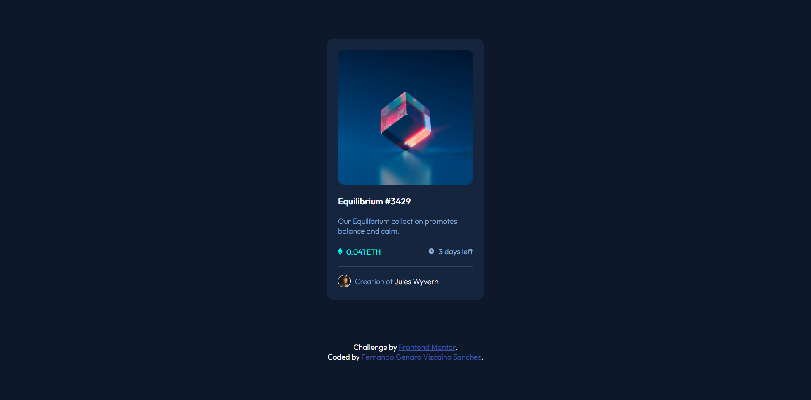

# Frontend Mentor - NFT preview card component solution

This is a solution to the [NFT preview card component challenge on Frontend Mentor](https://www.frontendmentor.io/challenges/nft-preview-card-component-SbdUL_w0U). Frontend Mentor challenges help you improve your coding skills by building realistic projects. 

## Table of contents

  - [The challenge](#the-challenge)
  - [Screenshot](#screenshot)
  - [Links](#links)
  - [Built with](#built-with)
  - [What I learned](#what-i-learned)
  - [Continued development](#continued-development)
  - [Useful resources](#useful-resources)
- [Author](#author)
- [Acknowledgments](#acknowledgments)


### The challenge

Users should be able to:

- View the optimal layout depending on their device's screen size
- See hover states for interactive elements

### Screenshot



### Links

- Solution URL: [Add solution URL here](https://your-solution-url.com)


### Built with

- Semantic HTML5 markup
- CSS custom properties
- Flexbox

### What I learned
I finally used variables in CSS.

```:root{
    --soft-blue: hsl(215, 51%, 70%);
    --cyan: hsl(178, 100%, 50%);
    --main-BG: hsl(217, 54%, 11%);
    --card-BG: hsl(216, 50%, 16%);
    --line: hsl(215, 32%, 27%);
    --white: hsl(0, 0%, 100%);
}
```

### Continued development

I have to learn how to use the mobile first, in order to make websites with responsive design.

### Useful resources

- [CSS :hover Selector](https://www.w3schools.com/cssref/sel_hover.asp) - This is an amazing article which helped me finally the property hover. I'd recommend it to anyone still learning this concept.


## Author

- Github - [Fernando Genaro Vizcaino Sanchez](https://github.com/Fgvs11)
- Frontend Mentor - [@Fgvs11](https://www.frontendmentor.io/profile/Fgvs11)

